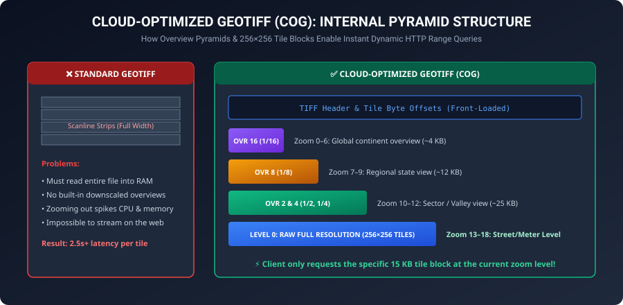

# 01. Geospatial Foundations & Learning Guide

This document provides a foundational understanding of GIS engineering, raster/vector structures, coordinate systems, and web tiling mathematics.

---

## 1. Rasters vs. Vectors: The Two Paradigms of GIS

All geographic data in computer software is represented in one of two fundamental data models:

```
                  ┌──────────────────────────────────────────────┐
                  │              GEOSPATIAL DATA                 │
                  └──────────────┬────────────────┬──────────────┘
                                 │                │
                     ┌───────────▼──┐       ┌─────▼────────────┐
                     │ VECTOR DATA  │       │   RASTER DATA    │
                     └───────────┬──┘       └─────┬────────────┘
                                 │                │
     Points, Lines, Polygons (GeoJSON, SHP)  Pixel Grid Matrix (GeoTIFF, COG)
```

### 1.1 Vector Data (Discrete Features)
* **What it is**: Geographic shapes defined by mathematical coordinates $(X, Y)$ with attached attributes.
* **Geometry Types**:
  - **Points**: Coordinates of single features (e.g. Bridge crossing pin `[76.520, 34.800]`, Command HQ).
  - **LineStrings**: Connected sequences of points (e.g. Roads, Rivers, Supply Lines).
  - **Polygons**: Closed geometric shapes (e.g. Country boundaries, Forest zones, Danger areas).
* **Common Formats**: GeoJSON, ESRI Shapefile (`.shp`), GeoPackage (`.gpkg`), FlatGeobuf.

### 1.2 Raster Data (Continuous Surfaces & Grids)
* **What it is**: A rectangular grid matrix of pixels (cells), where each cell has a row, a column, and a numeric value representing a measured or calculated property.
* **Examples**:
  - **Elevation (DEM / DTM)**: Pixel value = Height above sea level in meters (e.g. `3,420 m`).
  - **Bridge Suitability**: Pixel value = Numeric score from `1` (Low) to `5` (Optimal).
  - **Slope / Gradient**: Pixel value = Incline in degrees ($0^\circ$ to $90^\circ$).
  - **Satellite / Aerial Imagery**: Red, Green, Blue bands (3 bands of 0–255 intensity).
* **Common Formats**: GeoTIFF (`.tif`), Cloud-Optimized GeoTIFF (`.cog`), NetCDF, HDF5.

---

## 2. Cloud-Optimized GeoTIFF (COG) Pyramid Architecture



### 2.1 The Problem with Standard GeoTIFFs
A standard GeoTIFF stores pixels in horizontal strips (`Scanlines`). To read even a tiny $100 \times 100$ patch in the center of a $2\text{ GB}$ file, an application must download or read **the entire preceding half of the file**. This causes high RAM usage and makes dynamic web viewing impossible.

### 2.2 The COG Architecture
A **Cloud-Optimized GeoTIFF (COG)** organizes data internally with three crucial features:
1. **Internal Tiling**: Pixels are stored in small, self-contained square tiles ($256 \times 256$ or $512 \times 512$ pixels).
2. **Overview Pyramids (Decimations)**: Pre-downsampled lower-resolution versions of the image ($1/2, 1/4, 1/8, 1/16$) are embedded directly at the end of the file.
3. **Front-loaded Header**: File metadata and byte offsets are written at the very beginning. A server can issue an HTTP `Range: bytes=1048576-1064960` request to download **only the exact 16 KB chunk** needed for the current screen view!

---

## 3. Coordinate Reference Systems (CRS)

The Earth is an irregular 3D ellipsoid (geoid), but computer screens and paper maps are flat 2D planes. A **Coordinate Reference System (CRS)** defines how 3D locations on Earth map to 2D coordinates.

```
       3D Earth Ellipsoid (Latitude/Longitude)
                 │
                 │  Mathematical Map Projection
                 ▼
       2D Flat Projected Surface (X/Y Easting/Northing in Meters)
```

### The Three Most Important CRSs in Web GIS:

| CRS Code | Name | Units | Use Case |
| :--- | :--- | :--- | :--- |
| **`EPSG:4326`** | **WGS 84 (Geographic)** | Decimal Degrees ($^\circ$) | The global GPS standard. Coordinates are expressed as `Latitude (-90 to +90)` and `Longitude (-180 to +180)`. Example: `out.tif`. |
| **`EPSG:3857`** | **Web Mercator (Pseudo-Mercator)** | Meters ($m$) | The universal standard for all web maps (Google Maps, Leaflet, OpenStreetMap, Mapbox). Preserves angles and shapes locally. |
| **`EPSG:32643`** | **UTM Zone 43N (Projected)** | Meters ($m$) | High-accuracy local projection for Northern India / Ladakh. Preserves true ground distances in meters without distortion. Example: `Bridge_Suitability.tif`. |

---

## 4. How Web Tiling (Slippy Map / XYZ) Works

Web maps divide the entire globe into a pyramid of $256 \times 256$ pixel image tiles using the standard formula:

$$\text{Number of Tiles at Zoom } z = 2^z \times 2^z = 4^z$$

* **Zoom 0**: $1$ tile covers the entire planet ($256 \times 256\text{ px}$).
* **Zoom 1**: $2 \times 2 = 4$ tiles.
* **Zoom 10**: $1,024 \times 1,024 = 1,048,576$ tiles.
* **Zoom 18**: Over $68\text{ billion}$ tiles.

### Converting GPS Coordinates (Lat, Lon) to Tile $(Z, X, Y)$:

$$\begin{aligned}
x &= \left\lfloor \frac{\text{lon} + 180}{360} \cdot 2^z \right\rfloor \\
y &= \left\lfloor \left(1 - \frac{\ln(\tan(\text{lat}\cdot\frac{\pi}{180}) + \sec(\text{lat}\cdot\frac{\pi}{180}))}{\pi}\right) \cdot \frac{2^z}{2} \right\rfloor
\end{aligned}$$

When you pan to Ladakh (`Lat 34.80°N, Lon 76.52°E`) at Zoom 10, Leaflet computes $X=729, Y=407$ and requests:
`GET http://localhost:8001/cog/tiles/10/729/407.png?url=output/bridge_suitability_cog.tif`

---

## 5. Dynamic Color Lookup Tables (Symbology & LUTs)

A single-band raster contains raw numbers (e.g. Suitability $1, 2, 3, 4, 5$). A browser cannot display raw numbers directly; it can only render RGB color pixels.

### How Dynamic Colormapping Works:
1. **Rescaling**: The raw value $v \in [1, 5]$ is normalized to $[0.0, 1.0]$.
2. **Lookup Table (LUT)**: The normalized number is mapped to an RGBA color ramp:
   - $0.0 \to \text{Red } (215, 48, 39, 255)$ — Class 1 (Very Low)
   - $0.5 \to \text{Yellow } (254, 224, 139, 255)$ — Class 3 (Moderate)
   - $1.0 \to \text{Green } (26, 152, 80, 255)$ — Class 5 (Optimal)
3. **Alpha / Transparency Masking**: NoData values (`127`) and masked areas are assigned an Alpha channel of `0` (100% transparent), allowing the underlying base map to show through!
