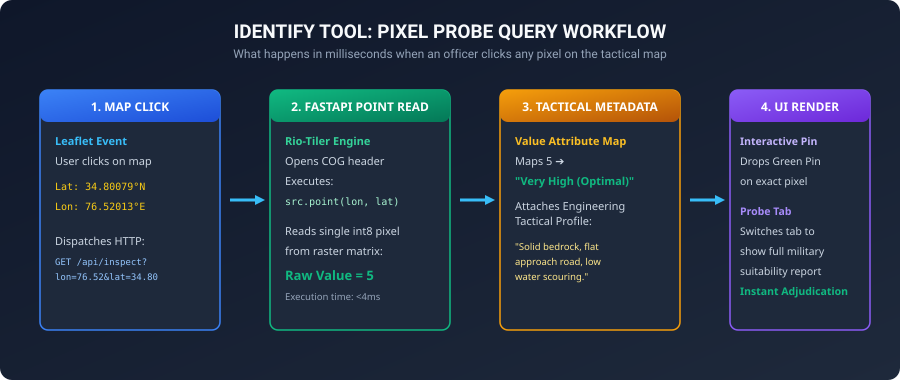
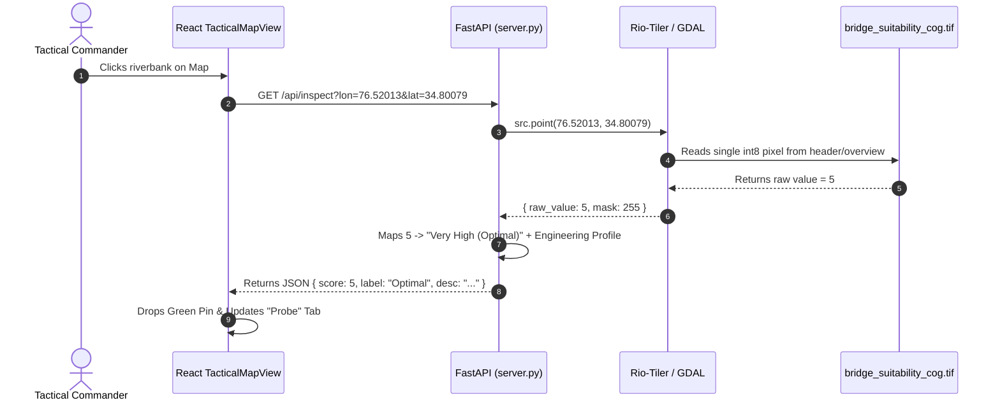

# 02. Current Implementation & Architecture

This document provides a complete technical walkthrough of the current codebase in `Wargaming-UI-`.

---

## 1. Visual System Architecture


```mermaid
flowchart LR
    A["Raw GeoTIFF<br/>(Bridge_Suitability.tif)<br/>65MB, EPSG:32643"] -->|rio-cogeo translate<br/>Deflate Compression| B["Cloud-Optimized GeoTIFF<br/>(bridge_suitability_cog.tif)<br/>Overviews: 2, 4, 8, 16"]
    B -->|Byte-Range Read| C["FastAPI + TiTiler<br/>(server.py on :8001)<br/>Dynamic LUT &amp; Masking"]
    C -->|/cog/tiles/{z}/{x}/{y}.png| D["Leaflet Map Viewport<br/>(React 19 Frontend)<br/>Auto-Pan, Layer Controls"]
    C -->|/api/inspect?lon=&amp;lat=| E["Identify Tool Probe<br/>Class 1-5 Military Description"]
```

---

## 2. Interactive Identify Tool (Pixel Probe Flow)





---

## 3. Backend Implementation Details (`server.py`)

The server uses **FastAPI**, **TiTiler Core**, and **Rio-Tiler** running under **Uvicorn** on port `8001`.

### 3.1 Key Endpoints:

#### 1. Dynamic Raster Tile Endpoint (`/cog/tiles/{z}/{x}/{y}.png`)
Generates dynamic PNG tiles on-the-fly with custom threshold masking and colormaps:
```python
@app.get("/cog/tiles/{z}/{x}/{y}.png")
def get_cog_tile(
    z: int, x: int, y: int,
    url: str = Query(default="output/bridge_suitability_cog.tif"),
    colormap_name: Optional[str] = Query(default=None),
    min_class: Optional[int] = Query(default=None),
    max_class: Optional[int] = Query(default=None)
):
    try:
        with Reader(str(cog_path)) as src:
            img = src.tile(x, y, z)
            
            # Dynamic Thresholding (e.g. Show only Class 4 & 5)
            if min_class is not None or max_class is not None:
                mask = (img.data[0] >= min_class) & (img.data[0] <= max_class) & (img.mask > 0)
                img.mask = np.where(mask, 255, 0).astype(np.uint8)
                if not np.any(img.mask):
                    return Response(content=EMPTY_TRANSPARENT_PNG, media_type="image/png")
            
            img.rescale([(1, 5)])
            content = img.render(img_format="PNG", colormap_name=colormap_name or "rdylgn")
            return Response(content=content, media_type="image/png")
    except TileOutsideBounds:
        # Gracefully return 1x1 transparent PNG when viewport extends past raster
        return Response(content=EMPTY_TRANSPARENT_PNG, media_type="image/png")
```

#### 2. Pixel Probe / Identify Endpoint (`/api/inspect`)
Returns exact pixel values, suitability classes, and descriptions for any GPS coordinate:
```python
@app.get("/api/inspect")
def inspect_point(lon: float, lat: float, url: str = "output/bridge_suitability_cog.tif"):
    try:
        with Reader(str(cog_path)) as src:
            pt = src.point(lon, lat)
            val = int(pt.data[0])
            return format_suitability_metadata(val, lon, lat)
    except (PointOutsideBounds, Exception):
        return { "valid": False, "label": "Outside Study Area" }
```

---

## 4. Frontend Implementation (`TacticalMapView.tsx`)

Located in [`src/features/narrative/TacticalMapView.tsx`](file:///c:/Users/Nikhil%20Vidhani/Desktop/WARGAMING-SUITE/Wargaming-UI-/src/features/narrative/TacticalMapView.tsx), built with React 19 + TypeScript + Leaflet.

### 4.1 Key Capabilities:
1. **Leaflet Map Lifecycle**:
   - Initialized inside a React `useEffect` using `useRef` to maintain clean lifecycle handling and avoid duplicate map containers on re-renders.
2. **Top 5 Surveyed Optimal Sites**:
   - **Kargil North Riverbed** (`34.85605°N, 76.43188°E`)
   - **Suru River Crossing** (`34.80079°N, 76.52013°E`)
   - **Sankoo Approach** (`34.77225°N, 76.54550°E`)
   - **Batalik Sector** (`34.98375°N, 76.37549°E`)
   - **Rangdum Valley** (`34.34166°N, 76.56256°E`)
3. **Interactive Pixel Probe**:
   - Leaflet `map.on('click')` captures clicked coordinates, triggers the `/api/inspect` endpoint, drops an animated circle marker, and displays the terrain breakdown in the **Probe** tab.
