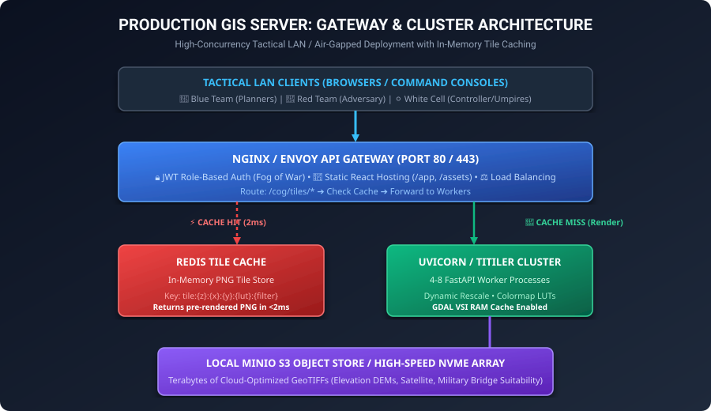
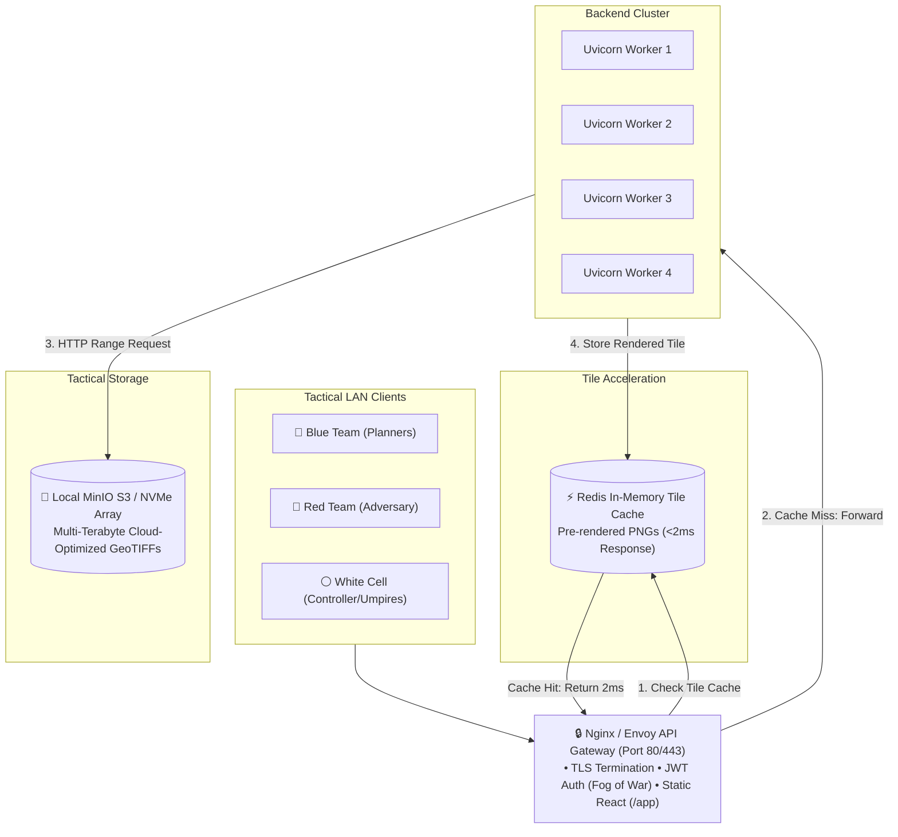

# 03. Production, Gateway & Tactical LAN Deployment

This document defines the production blueprint for deploying the Wargaming GIS Server in enterprise, tactical LAN, and air-gapped field environments.

---

## 1. Production Architecture (Gateway & Cluster Pattern)





---

## 2. 100% Air-Gapped / Tactical LAN Deployment (No Internet)

In forward command posts or field vehicle tactical operations centers (TOCs), the system must operate with **zero internet connection**.

### Step A: Self-Hosting Offline Basemaps
Instead of requesting public OpenStreetMap or Esri tiles over the internet, host vector or raster base maps locally using **TileServer-GL** or **Martin**:
1. Download regional `.mbtiles` package (e.g. `india_satellite_z0-14.mbtiles` or `openmaptiles_india.mbtiles`).
2. Run a local tile container:
   ```bash
   docker run -p 8080:8080 -v $(pwd)/tiles:/data maptiler/tileserver-gl
   ```
3. Update Leaflet basemap URL to:
   ```typescript
   url: 'http://192.168.1.100:8080/styles/tactical-dark/{z}/{x}/{y}.png'
   ```

### Step B: Multi-Terabyte COG Storage with MinIO
Rather than copying giant GeoTIFFs to every client machine, store them in a local **MinIO** instance (lightweight, self-hosted S3 object storage):
```python
# TiTiler reads directly from local S3 storage via byte-range requests
url = "s3://tactical-rasters/ladakh/bridge_suitability.tif"
```

---

## 3. Production Docker Compose Manifest

Create a `docker-compose.yml` to orchestrate the complete GIS stack:

```yaml
version: '3.8'

services:
  # 1. API Gateway & Reverse Proxy
  gateway:
    image: nginx:alpine
    ports:
      - "80:80"
      - "443:443"
    volumes:
      - ./nginx.conf:/etc/nginx/nginx.conf:ro
      - ./dist:/usr/share/nginx/html/app:ro
    depends_on:
      - tile-server
      - redis

  # 2. TiTiler / FastAPI Tile Engine Cluster
  tile-server:
    build:
      context: .
      dockerfile: Dockerfile
    command: gunicorn -w 4 -k uvicorn.workers.UvicornWorker -b 0.0.0.0:8001 server:app
    environment:
      - REDIS_URL=redis://redis:6379/0
      - GDAL_CACHEMAX=512
      - GDAL_DISABLE_READDIR_ON_OPEN=EMPTY_DIR
      - VSI_CACHE=TRUE
      - VSI_CACHE_SIZE=536870912
    volumes:
      - ./output:/app/output:ro
    depends_on:
      - redis

  # 3. Redis In-Memory Tile Cache
  redis:
    image: redis:alpine
    command: redis-server --maxmemory 2gb --maxmemory-policy allkeys-lru
    ports:
      - "6379:6379"

  # 4. Offline Base Map Server (Air-Gapped)
  offline-basemap:
    image: maptiler/tileserver-gl
    volumes:
      - ./basemaps:/data:ro
    ports:
      - "8080:8080"
```

---

## 4. High-Performance GDAL Environment Variables for Production

| Environment Variable | Recommended Value | Purpose |
| :--- | :--- | :--- |
| **`GDAL_CACHEMAX`** | `512` (MB) | Increases GDAL in-memory block cache size. |
| **`GDAL_DISABLE_READDIR_ON_OPEN`** | `EMPTY_DIR` | Prevents GDAL from listing whole directories when opening a COG. |
| **`CPL_VSIL_CURL_ALLOWED_EXTENSIONS`** | `.tif, .cog` | Restricts HTTP range probing to GeoTIFF extensions. |
| **`VSI_CACHE`** | `TRUE` | Caches byte range chunks in RAM to prevent duplicate S3 requests. |
| **`VSI_CACHE_SIZE`** | `536870912` (512 MB) | Sets the virtual file system cache buffer. |
