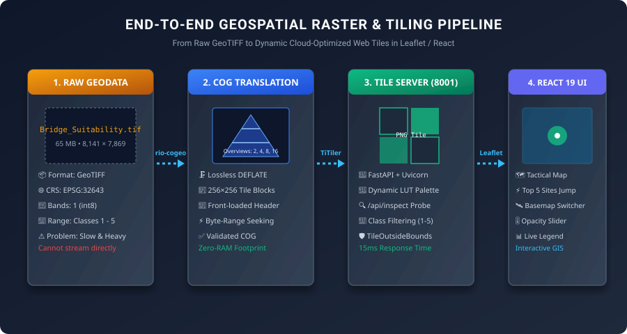

# 🗺️ Wargaming Tactical GIS & Dynamic Raster Tile Pipeline

Welcome to the comprehensive technical documentation for the **Wargaming Tactical GIS & Dynamic Raster Tiling Architecture**.

---

## 🌟 End-to-End Visual Architecture



---

## 📚 Documentation Index

| Document | Description |
| :--- | :--- |
| **[01. Geospatial Foundations & Learning](01_GEOSPATIAL_FOUNDATIONS_AND_LEARNING.md)** | Core theory: Rasters vs Vectors, Coordinate Systems, COG internal pyramids, Dynamic Web Tiling (XYZ / Web Mercator), and TiTiler mechanics. |
| **[02. Current Implementation & Architecture](02_CURRENT_IMPLEMENTATION_ARCHITECTURE.md)** | Codebase walkthrough: FastAPI + TiTiler backend (`server.py`), React + Leaflet frontend (`TacticalMapView.tsx`), and datasets (`Bridge_Suitability.tif`). |
| **[03. Production, Gateway & LAN Deployment](03_PRODUCTION_LAN_AND_GATEWAY_DEPLOYMENT.md)** | Enterprise deployment: API Gateways, Nginx/Redis tile caching, Air-Gapped LAN setup, MinIO storage, Docker Compose, and tactical wargaming security. |
| **[04. Troubleshooting, Edge Cases & FAQs](04_TROUBLESHOOTING_EDGE_CASES_AND_FAQ.md)** | Complete guide to GIS "ifs and buts": `TileOutsideBounds` handling, coordinate ordering, NoData masking, projection traps, and performance optimizations. |

---

## 🏗️ Visual Diagrams Included in the Documentation

| Diagram | Location | Description |
| :--- | :--- | :--- |
| **Full Pipeline Overview** | [`assets/pipeline_architecture.svg`](assets/pipeline_architecture.svg) | Step-by-step from raw GeoTIFF $\to$ COG $\to$ TiTiler $\to$ React 19 UI. |
| **COG Pyramid Internals** | [`assets/cog_pyramid_structure.svg`](assets/cog_pyramid_structure.svg) | Comparison of standard TIFF scanlines vs. COG overview pyramids. |
| **Production Gateway & Cluster** | [`assets/gateway_production_cluster.svg`](assets/gateway_production_cluster.svg) | High-concurrency Nginx reverse proxy + Redis cache + MinIO S3 cluster. |
| **Identify Tool Pixel Probe** | [`assets/pixel_probe_flow.svg`](assets/pixel_probe_flow.svg) | Sequence diagram showing click-to-inspection in $<4\text{ms}$. |

---

## ⚡ Quick Start: Running the Current System

```powershell
# 1. Navigate to repository
cd "c:\Users\Nikhil Vidhani\Desktop\WARGAMING-SUITE\Wargaming-UI-"

# 2. Activate Python Virtual Environment
.\.venv\Scripts\Activate.ps1

# 3. Start Unified Tile + Web Server
python server.py
```

- **React Tactical Application**: [http://localhost:8001/app/](http://localhost:8001/app/)
- **Live Tile Endpoint**: [http://localhost:8001/cog/tiles/10/729/407.png?url=output/bridge_suitability_cog.tif](http://localhost:8001/cog/tiles/10/729/407.png?url=output/bridge_suitability_cog.tif)
- **Pixel Probe API**: [http://localhost:8001/api/inspect?lon=76.52013&lat=34.80079](http://localhost:8001/api/inspect?lon=76.52013&lat=34.80079)
