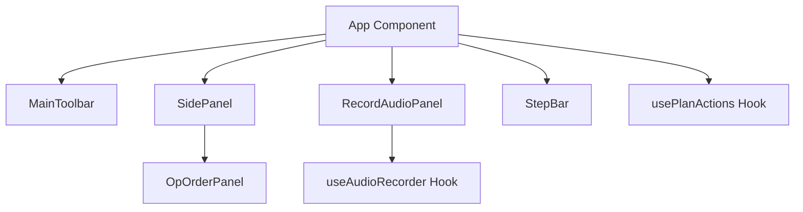

# Low-Level Design (LLD) Specification: Code Refinement & Modularization

This document outlines the low-level design (LLD) to refactor the Wargaming-UI dashboard, transforming inline styled components and unified business logic into modular, highly typed, and maintainable TypeScript patterns.

---

## 1. Architectural Architecture & Concerns



### Separation of Concerns (SoC)
*   **Presentation Layer:** React components should strictly represent the layout, styling, and visual rendering.
*   **Business Logic Layer:** Async browser actions (Audio recording, wavesurfer loading, native file parsing, API integrations) are extracted into custom, reusable React hooks.
*   **State Layer:** Reducer and Context store state parameters, avoiding local prop-drilling.

---

## 2. Refactoring Strategy

### Phase A: Custom Hooks Integration (Logic Extraction)
To untangle layout files, we isolate hardware-level interfaces and files operations into clean React Hooks:

#### 1. `useAudioRecorder.ts` (Record & Playback Controller)
Isolates wavesurfer initialization, `RecordPlugin` recording lifecycles, playback, seeking, and state flags from [RecordAudioPanel.tsx](file:///c:/Users/Nikhil Vidhani/Desktop/Wargaming-UI-/src/features/recordAudio/RecordAudioPanel.tsx).

*   **API Interface:**
    ```typescript
    interface UseAudioRecorderResult {
      waveformRef: React.RefObject<HTMLDivElement>;
      isRecording: boolean;
      isPaused: boolean;
      isTranscribing: boolean;
      hasAudio: boolean;
      isPlaying: boolean;
      error: string | undefined;
      startRecording: () => Promise<void>;
      stopRecording: () => void;
      togglePauseRecording: () => void;
      togglePlayPausePlayback: () => void;
      stopPlayback: () => void;
      discardAudio: () => void;
      seekBackward: () => void;
      seekForward: () => void;
    }
    ```

#### 2. `usePlanActions.ts` (File Operations Handler)
Isolates native browser file selection parsing (`FileReader`, XML/JSON decoding) and wargaming template generation triggers from [App.tsx](file:///c:/Users/Nikhil Vidhani/Desktop/Wargaming-UI-/src/App.tsx).

*   **API Interface:**
    ```typescript
    interface UsePlanActionsResult {
      loadPlanRef: React.RefObject<HTMLInputElement>;
      uploadAudioRef: React.RefObject<HTMLInputElement>;
      uploadDocumentRef: React.RefObject<HTMLInputElement>;
      uploadImageRef: React.RefObject<HTMLInputElement>;
      handleLoadPlanChange: (e: React.ChangeEvent<HTMLInputElement>) => void;
      handleUploadAudioChange: (e: React.ChangeEvent<HTMLInputElement>) => Promise<void>;
      handleUploadDocumentChange: (e: React.ChangeEvent<HTMLInputElement>) => void;
      handleUploadImageChange: (e: React.ChangeEvent<HTMLInputElement>) => void;
      handleCreatePlan: () => void;
    }
    ```

---

### Phase B: Strict Domain Typing
Standardize on TypeScript interfaces for wargaming domain boundaries to prevent `any` castings:

```typescript
export interface WargamingPlan {
  reportNumber: string;
  classification: string;
  dtg: string;
  references: string;
  from: string;
  to: string;
  mission: string;
  execution: string;
}

export type DictationTarget = 'mission' | 'execution' | 'none';

export interface TranscribeResponse {
  text: string;
  confidence?: number;
}
```

---

### Phase C: CSS Modularization (App.module.css)
Extract inline CSS declarations inside [App.tsx](file:///c:/Users/Nikhil Vidhani/Desktop/Wargaming-UI-/src/App.tsx) into a dedicated [App.module.css](file:///c:/Users/Nikhil Vidhani/Desktop/Wargaming-UI-/src/App.module.css) file. This ensures cleaner markup and consistent variables mapping.

*   **Styles to Extract:**
    *   `.layoutContainer` (Main height 100vh flexbox grid)
    *   `.titleHeader` (Mock blue title bar)
    *   `.mainWorkspace` (Active recording blue outline layout)
    *   `.sidebarContainer` (Aside column block)
    *   `.savedPlansPlaceholder` (Blank saved plans listing)

---

## 3. Implementation Blueprint

### File Structure Reorganized
```bash
src/
  ├── components/
  │    ├── IconButton.tsx
  │    ├── SidePanel.tsx
  │    └── StepBar.tsx
  ├── hooks/
  │    ├── useAudioRecorder.ts     # NEW (Extracted wavesurfer logic)
  │    └── usePlanActions.ts       # NEW (Extracted file loading logic)
  ├── features/
  │    ├── opOrder/
  │    │    ├── OpOrderPanel.tsx
  │    │    └── OpOrderPanel.module.css
  │    └── recordAudio/
  │         ├── RecordAudioPanel.tsx
  │         └── RecordAudioPanel.module.css
  ├── App.tsx                      # Clean layout composition
  └── App.module.css               # NEW (Decoupled inline CSS styles)
```
