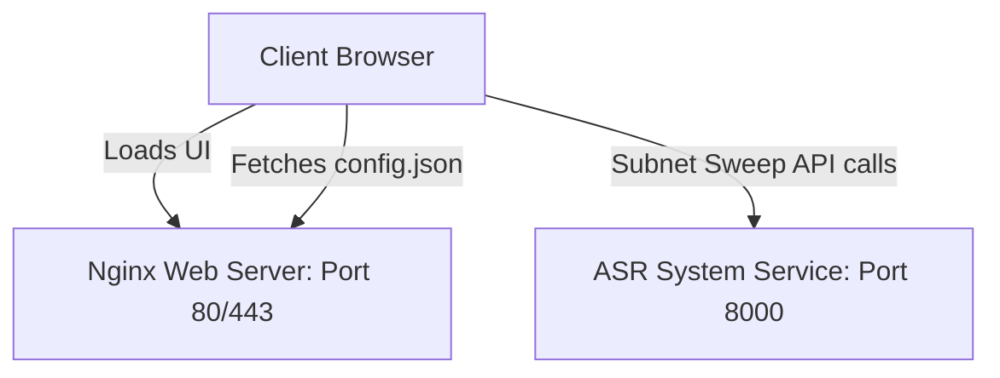

# Professional Production Deployment Guide

This guide details the step-by-step procedure to deploy the Land Wargaming Console (React UI) and the ASR (Speech Recognition) server in a professional, high-availability LAN environment.

---

## Architecture Overview

In a professional production setup:
1.  **Frontend (UI):** Built into optimized static files (`dist/`) and served by a high-performance web server (**Nginx**).
2.  **ASR Backend:** Runs as a background system daemon (**Windows Service** or **Systemd Service**).
3.  **Discovery Config:** An automated startup task writes the server's active LAN IP to `config.json` inside the web root, enabling automatic client-side ASR discovery.



---

## Phase 1: Deploying the Frontend (Nginx)

### 1. Compile the Production Build
On your build machine, run:
```bash
npm run build
```
This compiles your code into the `/dist` folder. Copy this `/dist` folder to your target deployment server (e.g., `C:\wargaming\dist` or `/var/www/wargaming`).

### 2. Configure Nginx
Install Nginx and update the `nginx.conf` file to serve the `/dist` directory on wildcard ports:

```nginx
server {
    listen 80 default_server;
    listen [::]:80 default_server;
    
    # Enable gzip compression for fast LAN loading
    gzip on;
    gzip_types text/plain text/css application/json application/javascript text/xml;

    root /var/www/wargaming; # Path to your built dist/ directory
    index index.html;

    location / {
        try_files $uri $uri/ /index.html;
    }
}
```

---

## Phase 2: Deploying ASR Backend as a System Service

To prevent the backend from closing when a user logs out of the server, run it as a service.

### Option A: On Windows (using NSSM)
1.  Download **NSSM** (Non-Sucking Service Manager) from [nssm.cc](https://nssm.cc/).
2.  Open command prompt as Administrator and run:
    ```cmd
    nssm install WargamingASR
    ```
3.  In the GUI dialog that appears:
    *   **Path:** Select your python executable (e.g. `C:\Python310\python.exe`).
    *   **Arguments:** Pass the server start script (e.g. `-m uvicorn main:app --host 0.0.0.0 --port 8000`).
    *   **Startup Type:** Set to **Automatic**.
4.  Click **Install service**.

### Option B: On Linux (Systemd)
Create a service file `/etc/systemd/system/wargaming-asr.service`:
```ini
[Unit]
Description=Wargaming ASR Backend Service
After=network.target

[Service]
Type=simple
User=wargaming
WorkingDirectory=/opt/wargaming-asr
ExecStart=/opt/wargaming-asr/venv/bin/uvicorn main:app --host 0.0.0.0 --port 8000
Restart=always

[Install]
WantedBy=multi-user.target
```
Enable and start the service:
```bash
sudo systemctl daemon-reload
sudo systemctl enable wargaming-asr --now
```

---

## Phase 3: Automating LAN IP Discovery

Configure the server to write its active LAN IP to `/config.json` every time the server boots up:

### Windows Startup Script (`update_ip.bat`)
Save this script in `C:\wargaming\update_ip.bat` and schedule it in **Windows Task Scheduler** to trigger **At Startup**:
```batch
@echo off
:: Find active IPv4 address
for /f "tokens=4 delims= " %%i in ('route print ^| findstr 0.0.0.0 ^| findstr /v "127.0.0.1"') do (
    set LAN_IP=%%i
)
:: Write to Nginx web root directory
echo {"server_ip": "%LAN_IP%"} > "C:\wargaming\dist\config.json"
```

---

## Phase 4: Network & Firewall Configuration

Ensure your server's operating system allows incoming traffic on the required ports:

### Windows Firewall Configuration
Open PowerShell as Administrator and enable incoming ports:
```powershell
# Open Port 80 (HTTP UI Access)
New-NetFirewallRule -DisplayName "Wargaming Console UI" -Direction Inbound -Action Allow -Protocol TCP -LocalPort 80

# Open Port 8000 (ASR Scanner & API Access)
New-NetFirewallRule -DisplayName "Wargaming ASR Service" -Direction Inbound -Action Allow -Protocol TCP -LocalPort 8000
```

### Linux Firewall Configuration (UFW)
```bash
sudo ufw allow 80/tcp
sudo ufw allow 8000/tcp
sudo ufw reload
```
